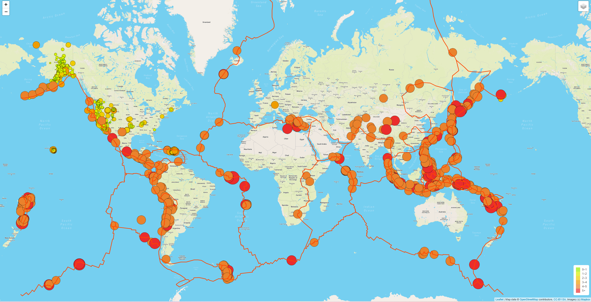
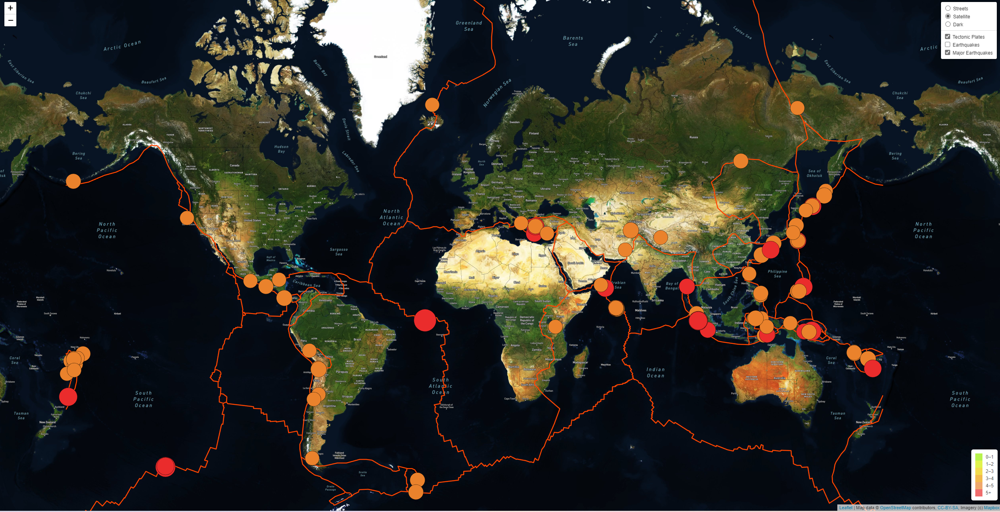

# Mapping_Earthquakes
## Project Purpose
The purpose of this project was to create a webpage using javascript, HTML, and CSS to display earthquake data that was obtained via an API call to the USGS earthquake website. The javascript code includes the ability for the user to select from three different background maps and three different data overlays.

## Project Overview
### All Earthquakes From the Past Seven Days:

### Only Major Earthquakes (4.5+) From the Past Seven Days:

